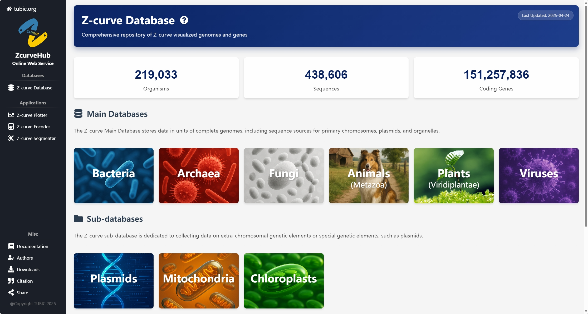
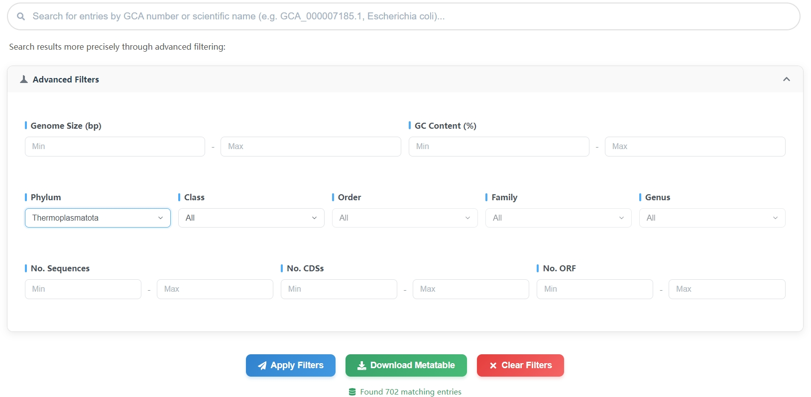

# ZcurveDB
The Z-curve Database is a comprehensive visual database of more than 200,000 genomes. It allows browsing the Z-curve and all its variants for any region of a genomic sequence through an embedded Z-curve Plotter, with free adjustment of smoothness. In addition, it provides a visualization of coding sequence features based on Z-curve parameters (generated by the Z-curve Encoder) and can be used for simple sequence coding capability analysis (deciding whether a sequence has the potential to encode a protein in a species).
## Home Page
The home page provides information and statistics on the overall situation of the Z-curve Database. For the convenience of retrieval, we divide the database into two types: main database and sub-database. The former stores data in units of complete genomes, currently including 6 modules: **Bacteria**, **Archaea**, **Fungi**, **Plants**, **Animals**, **Viruses**; the latter stores sequences of extra-chromosomal genetic elements or special genetic elements, such as **Plasmids**. Click on the small covers to enter the corresponding database.

## Search
We offer multiple ways to retrieve or filter the genomes. You can search directly by the species scientific name or the GCA/GCF number, or filter through genomic size, GC content, taxonomy, the number of sequences in the Assembly, the number of genes and the number of open reading frames. All search results can be displayed in real time in the web table below or downloaded and saved as a meta-table.

**Note**: The taxonomic method of viruses is too complex, so we provide a direct search method instead of a group of selection boxes.

