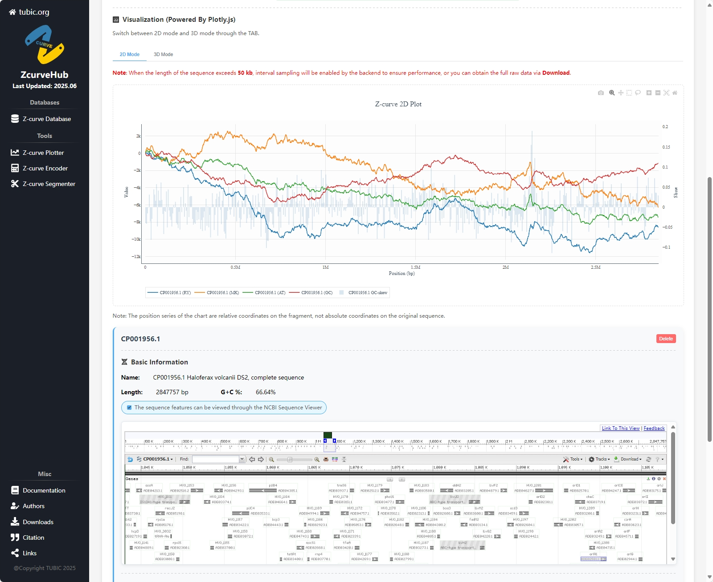

# Introduction
The unified symmetrical theory of DNA sequences, also known as **Z-curve theory**, is a systematic method for analyzing DNA sequences through geometric representations. Rooted in group theory, this approach maps any nucleic sequence to a unique three-dimensional curve, enabling comprehensive analysis of nucleotide distributions and spatial configurations. As an efficient feature extraction framework, Z-curve theory has been widely adopted in bioinformatics for genomic functional region identification (e.g., coding genes, promoters, replication origins, horizontal gene transfer islands), nucleosome protein-DNA interaction studies, protein-non-coding RNA binding analysis.  

Despite its broad impact on international bioinformatics research, existing implementations remain fragmented across specialized tools. To address this gap, the **T**ianjin **U**niversity **B**io**I**nformatics **C**enter (**TUBIC**) developed **ZcurveHub** – a trinity platform integrating:  
- Database that stores over 220,000 Z-curve visualized genome records (https://tubic.tju.edu.cn/zcurve/database)
- Multiple web tools that can conduct genomic analysis online (https://tubic.tju.edu.cn/zcurve)
- Python package **ZcurvePy** with flexible APIs and commandline tools (https://pypi.org/project/zcurvepy/)


## Main Functions
ZcurveHub mainly integrates 4 basic functions :
- **Genome Visualization with Z-curves**  
Generate Z-curves and their derivatives (e.g., GC disparity, CpG profile) from nucleotide sequences, with customizable visualization displayed in 2D or 3D. Supports FASTA and GenBank formats. The following table lists the main curve types provided by ZcurveHub:
    |Name                     |Mathematical Expression                | Python API                  | CLT Code |
    |:-----------------------:|:--------------------------------------|:----------------------------|:--------:|
    |RY disparity             |$x_{n}=(A_{n}+G_{n})-(C_{n}+T_{n})$    |ZcurvePlotter.RY_disparity   |RY        |
    |MK disparity             |$y_{n}=(A_{n}+C_{n})-(G_{n}+T_{n})$    |ZcurvePlotter.MK_disparity   |MK        |
    |WS disparity             |$z_{n}=(A_{n}+T_{n})-(G_{n}+C_{n})$    |ZcurvePlotter.WS_disparity   |WS        |
    |AT disparity             |$d_{\rm AT}(n)=A_{n}-T_{n}$            |ZcurvePlotter.AT_disparity   |AT        |
    |GC disparity             |$d_{\rm GC}(n)=G_{n}-C_{n}$            |ZcurvePlotter.GC_disparity   |GC        |
    |x' curve                 |$x_{n}^{'}=x_{n} - kn$                 |ZcurvePlotter.x_prime_curve  |XP        |
    |y' curve                 |$y_{n}^{'}=y_{n} - kn$                 |ZcurvePlotter.y_prime_curve  |YP        |
    |z' curve                 |$z_{n}^{'}=z_{n} - kn$                 |ZcurvePlotter.z_prime_curve  |ZP        |
    |AT' curve                |$d_{\rm AT}^{'}(n)=d_{\rm AT}(n) - kn$ |ZcurvePlotter.AT_prime_curve |AP        |
    |GC' curve                |$d_{\rm GC}^{'}(n)=d_{\rm GC}(n) - kn$ |ZcurvePlotter.GC_prime_curve |GP        |
    |CpG profile              |$z_{n}=2{CpG}_{n} - (k + 1)n$          |ZcurvePlotter.CpG_prime_curve|CG        |           
- **Feature Extraction and Selection**  
Extract and select features using Z-curve parameters more flexibly compared to non-standalone modules integrated into other softwares, and explores its powerful application in gene prediction, promoter classification, replication origin recognition, etc., with machine learning or deep learning. The following table lists the calculation methods of Z-curve transformation provided by ZcurveHub: 
    |Name                             |Mathematical Expression                                | Python API                  | Digit    |
    |:-------------------------------:|:------------------------------------------------------|:----------------------------|:--------:|
    |Mononucleotide Z-curve|$x=(a+g)-(c+t)$<br/>$y=(a+c)-(g+t)$<br/>$z=(a+t)-(g+c)$|ZcurveEncoder.mononucl_transform|$3$|
    |Dinucleotide Z-curve|$x^{\rm N}=[p({\rm NA})+p({\rm NG})]-[p({\rm NC})+p({\rm NT})]$<br/>$y^{\rm N}=[p({\rm NA})+p({\rm NC})]-[p({\rm NG})+p({\rm NT})]$<br/>$z^{\rm N}=[p({\rm NA})+p({\rm NT})]-[p({\rm NG})+p({\rm NC})]$|ZcurveEncoder.dinucl_transform|$12$|
    |Trinucleotide Z-curve|$x^{\rm XY}=[p({\rm XYA})+p({\rm XYG})]-[p({\rm XYC})+p({\rm XYT})]$<br/>$y^{\rm XY}=[p({\rm XYA})+p({\rm XYC})]-[p({\rm XYG})+p({\rm XYT})]$<br/>$z^{\rm XY}=[p({\rm XYA})+p({\rm XYT})]-[p({\rm XYG})+p({\rm XYC})]$|ZcurveEncoder.trinucl_transform|$48$|
    |Mononucleotide Phasic Z-curve|$x_i=(a_i+g_i)-(c_i+t_i)$<br/>$y_i=(a_i+c_i)-(g_i+t_i)$<br/>$z_i=(a_i+t_i)-(g_i+c_i)$|ZcurveEncoder.mononucl_phase_transform  |$3i_{\rm max}$        |
    |Dinucleotide Phasic Z-curve|$x_i^{\rm N}=[p_i({\rm NA})+p_i({\rm NG})]-[p_i({\rm NC})+p_i({\rm NT})]$<br/>$y_i^{\rm N}=[p_i({\rm NA})+p_i({\rm NC})]-[p_i({\rm NG})+p_i({\rm NT})]$<br/>$z_i^{\rm N}=[p_i({\rm NA})+p_i({\rm NT})]-[p_i({\rm NG})+p_i({\rm NC})]$|ZcurveEncoder.dinucl_phase_transform|$12i_{\rm max}$|
    |Trinucleotide Phasic Z-curve|$x_i^{\rm XY}=[p_i({\rm XYA})+p_i({\rm XYG})]-[p_i({\rm XYC})+p_i({\rm XYT})]$<br/>$y_i^{\rm XY}=[p_i({\rm XYA})+p_i({\rm XYC})]-[p_i({\rm XYG})+p_i({\rm XYT})]$<br/>$z_i^{\rm XY}=[p_i({\rm XYA})+p_i({\rm XYT})]-[p_i({\rm XYG})+p_i({\rm XYC})]$|ZcurveEncoder.trinucl_phase_transform|$48i_{\rm max}$|
    |K-nucleotide Phasic Z-curve|$x_i^{\rm N_{k-1}}=[p_i({\rm N_{k-1}A})+p_i({\rm N_{k-1}G})]-[p_i({\rm N_{k-1}C})+p_i({\rm N_{k-1}T})]$<br/>$y_i^{\rm N_{k-1}}=[p_i({\rm N_{k-1}A})+p_i({\rm N_{k-1}C})]-[p_i({\rm N_{k-1}G})+p_i({\rm N_{k-1}T})]$<br/>$z_i^{\rm N_{k-1}}=[p_i({\rm N_{k-1}A})+p_i({\rm N_{k-1}T})]-[p_i({\rm N_{k-1}G})+p_i({\rm N_{k-1}C})]$|ZcurveEncoder.k_nucl_phase_transform|$3·4^{k-1}i_{\rm max}$|

    **\*** The value of $k$ and $i_{\rm max}$ varies in the integer range [1, 6].
- **Accurate Curve Segmentation**  
Detect critical structural boundaries using genome order index algorithm, identifying candidate regions for replication origins, genomic islands, or isochores and CpG islands in eukaryotic genomes. The following table lists the order index for each segmentation algorithm:
    | Segmentation Target | Order Index S(P)                | Application                       |
    |:-------------------:|:--------------------------------|:----------------------------------|
    |Z-curve              |$S({\rm P})=a^2+g^2+c^2+t^2$     |Replication Origin Recognition     |
    |RY disparity         |$S({\rm P})=(a^2+g^2)+(c^2+t^2)$ |Mitochondrial rRNA Region Search   |
    |MK disparity         |$S({\rm P})=(a^2+c^2)+(g^2+t^2)$ |Mitochondrial $\rm O_L$ Recognition|
    |WS disparity         |$S({\rm P})=(a^2+t^2)+(g^2+c^2)$ |Genome Island / Isochore Search              |
    |AT disparity         |$S({\rm P})=a^2+t^2$             |                                   |
    |GC disparity         |$S({\rm P})=g^2+c^2$             |Leading/Lagging Chain search       |
    |CpG profile        |$S({\rm P})=[p_n({\rm CpG})]^2+[1-p_n({\rm CpG})]^2$ |CpG Island Search|
- **Build Classification Models**  
Construct nucleic acid sequence classifier with biological function based on machine learning framework, high-precision protein gene recognizers for specific species taxa of prokaryotes, which is very useful when studying resequenced species or newly sequenced that are closely related.
## Technical Highlights
1. **High-Performance Hybrid Architecture**
    - **C/C++ Acceleration**  
    Core algorithmic modules are implemented natively in C/C++ and seamlessly integrated with Python via dynamic libraries (DLL/SO), where C++ classes and functions are wrapped into Python-callable objects using native Python C/C++ APIs, balancing development efficiency with runtime performance. Both of the Python package and the Flask backend of web service are developed based on the C++ core.
    - **Vivid Visualization**  
    The visualization module of the network service is written using React-plotly.js and graphically accelerated based on WebGL to obtain good user interactivity and smooth display, facilitating real-time adjustment of parameters to achieve the best visualization effect. The visualization module of CLT is written in Matplotlib and has more flexible adjustable parameters.
    - **Parallel Computing**  
    The Python package allows multi-threaded parallelization, achieving 4-6x speedup for large-scale genomic data processing (e.g., 765-bit Z-curve parameters generation for *S. cerevisiae*'s CDS sequences takes 0.3 seconds vs. 1.3 seconds in single-threaded mode)
2. **Cross-Paradigm Interfaces**
    - **Web Service Interfaces**  
    User-friendly Web interface enables you to quickly analyze data using cloud resources without installation, making it easy for beginners.  
    
    - 

    - **Command-Line Interface**  
    Streamlined CLI commands for batch processing and pipeline integration, ideal for bioinformatics workflows, e.g.
        ```bash
        zcurve-encoder -f example.fa -s settings.json -o features.csv
        ```
    
    - **Python API**  
    Object-oriented interfaces for developers, enabling customizable workflows, e.g.
        ```python
        # Init ZcurveEncoder
        from ZcurvePy import BatchZcurveEncoder
        hyper_params = [ ... ]
        encoder = BatchZcurveEncoder(hyper_params, n_jobs=8)
        # Load and process data
        from Bio.SeqIO import parse
        records = parse("example.fa", "fasta")
        features = encoder(records)
        ```
3. **Ecosystem Integration**  
    - **Data Connectivity**  
    Built-in integration with [Biopython](https://pypi.org/project/biopython/) modules for direct sequence retrieval from NCBI databases, with automated parsing of FASTA/GenBank formats.
    - **ML Compatibility**  
    Extracted Z-curve features are directly compatible with [scikit-learn](https://scikit-learn.org/) (traditional ML) and [PyTorch](https://scikit-learn.org/) (deep learning), including pre-trained models (e.g., Ori-FinderH, Nmix).
    - **Visualization Tools**  
    Export Z-curve trajectories as [Matplotlib](https://matplotlib.org/) static plots (e.g., *.png)or [Plotly](https://plotly.com/) interactive HTML.
