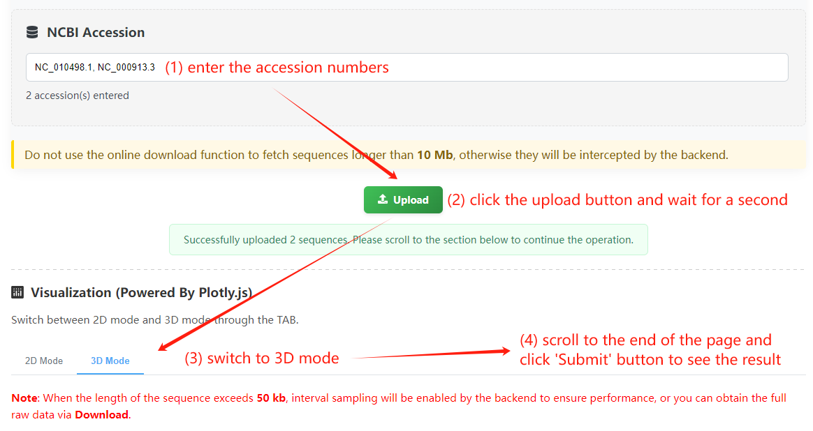
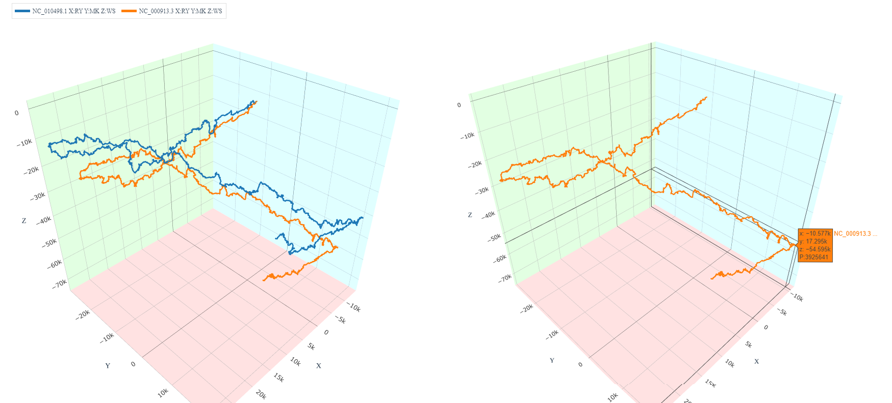
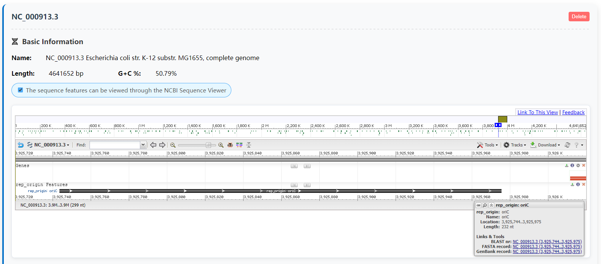

# Quickstart
Here we provide usage examples of web tools and Python package, as well as the installation method of the latter.
## Web Tools
*Note: We will not elaborate on the meanings of each parameter in this chapter's tutorial. If you want to know about it, please refer to [here](./tools.md).*
### Usage Examples
#### Z-curve Plotter
In this section, we will show how to visualize and compare genomes of different species strains, and find the DNA replication origins of them (for bacteria). First, choose 2 genomes and upload them. For convenience, We upload the example sequences (*E. coli* SMS-3-5 [NC_010498.1](https://www.ncbi.nlm.nih.gov/nuccore/NC_010498.1) and MG1655 [NC_000913.3](https://www.ncbi.nlm.nih.gov/nuccore/NC_000913.3)) through the online download function, which is able to fetch data from NCBI Nucleotide database. You can also upload your own files to complete this step.  

  

Then switch the plotter mode to 3D mode, adjust the settings and submit via the button below. Our example uses the original version of the Z curve, so we just use the default values. Finally, you can see the 3D representation of the two genomes. Obviously, the two genomes have similar geometric structures, which indicates that they have the same organizational pattern, only differing in local details.  



Due to the significant compositional differences between the leading and lagging strands of the bacterial genome, the shape of the Z curve will be in the form of a "Z", and the replication origin element is located at the turning point. A turning point of SMS-3-5 is 3925461, which corresponds to the replication initiation point (3925744..3925975) as annotated by NCBI.



## Python Package
### Installation
Python includes the package management system `pip` which should allow you to install ZcurvePy and its dependencies if needed, as well as upgrade or uninstall with just one command in the terminal:
```bash
python -m pip install zcurvepy
python -m pip install --upgrade zcurvepy

python -m pip uninstall zcurvepy
```
Starting from 1.5.11, the return value types of some frequently used API functions have been modified from Python list to Numpy ndarray. Therefore, please install Numpy 1.x before compiling and installing.
```bash
python -m pip install "numpy>=1.21,<2.0"
```
#### Python Requirements
Python 3.7, 3.8, 3.9, 3.10, 3.11, 3.12 are supported. We currently recommend using Python 3.9.6 (https://www.python.org/downloads/release/python-396/)
#### Operating System
Windows 10/11, macOS, and Linux running on x86_64 arch are supported. Note that some features of Matplotlib may not work on systems without a graphic interface (e.g., RedHat).
### Usage Examples
1. Generate Z-curves and derivatives  
   (1) Python API implementation:  

    ```python
    from ZcurvePy import ZcurvePlotter
    from ZcurvePy.Util import download_acc
    from Bio.SeqIO import read
    import matplotlib.pyplot as plt
    # Download genomes (Please wait for several seconds)
    save_paths = download_acc("NC_000854.2,NC_000868.1")
    ax3d = plt.figure().add_subplot(projection='3d')
    ax2d = plt.figure().add_subplot()
    for save_path in save_paths:
        record = read(save_path, "fasta")
        # Calculate components of smoothed Z-curve
        plotter = ZcurvePlotter(record)
        n, x, y, _ = plotter.z_curve(window=1000)
        zp, _ = plotter.z_prime_curve(window=1000, return_n=False)
        # Matplotlib 2D display
        ax2d.plot(n[::10], x[::10], label=f"{record.id} RY-disparity")
        ax2d.plot(n[::10], y[::10], label=f"{record.id} MK-disparity")
        ax2d.plot(n[::10], zp[::10], label=f"{record.id} Z'n curve")
        ax2d.legend()
        # Matplotlib 3D display
        ax3d.plot(x[::10], y[::10], zp[::10], label=f"{record.id} Z-curve")
        ax3d.legend()
    plt.show()
    ```
    (2) Commandline usage:  
    For plotting curves in 2D mode:
    ```bash
    zcurve-plotter -a NC_000854.2,NC_000868.1 -s settings.json -p curves.png -o curves_2d.json
    ```
    and for plotting curves in 3D mode:
    ```bash
    zcurve-plotter-3d -a NC_000854.2,NC_000868.1 -s settings.json -p curves.png -o curves_3d.json
    ```
    where the settings should be a JSON like:
    ```json
    {
        "plotter": [
            {
                "window": 10000, 
                "intv": 100,
                "curve2d": "RY,MK,ZP",
                "curve3d": "RY:MK:ZP"
            },
            {
                "window": 10000, 
                "intv": 100,
                "curve2d": "RY,MK,ZP",
                "curve3d": "RY:MK:ZP"
            }
        ]
    }
    ```
    Note that the Z-curve Plotter's 3D mode allows you to select 3 of the 11 curves as components of x,y, and z.  
    For more help information about the setting file, please enter:

    ```bash
    zcurve-plotter --help
    ```
2. Extract Z-curve parameter features  
    (1) Python API implementation:  

    ```python
    from ZcurvePy.Util import download_acc, extract_CDS
    import numpy as np
    save_paths = download_acc("NC_000854.2", __name__, "gb")
    records = extract_CDS(save_paths[0])

    from ZcurvePy import ZcurveEncoder
    def encoding(record):
        """ simple batch processing """
        encoder = ZcurveEncoder(record)
        # Calculate and concatenate 765-bit Z-curve transform
        feature = encoder.mononucl_phase_transform(freq=True)
        feature = np.concatenate((feature, encoder.dinucl_phase_transform(freq=True)))
        feature = np.concatenate((feature, encoder.trinucl_phase_transform(freq=True)))
        feature = np.concatenate((feature, encoder.k_nucl_phase_transform(k=4, freq=True)))
        return feature

    features = np.array([encoding(record) for record in records])
    print(features.shape)
    ```

    or use another more powerful API to implement multi-threading:

    ```python
    from ZcurvePy import BatchZcurveEncoder
    # Define the hyper-paramsfor 765-bit Z-curve transform
    hyper_params = [
        {"k": 1, "freq": True}  # Same as mononucl_phase_transform(freq=True)
        {"k": 2, "freq": True}  # Same as dinucl_phase_transform(freq=True)
        {"k": 3, "freq": True}  # Same as trinucl_phase_transform(freq=True)
        {"k": 4, "freq": True}  # Same as k_nucl_phase_transform(k=4, freq=True)
    ]
    encoder = BatchZcurveEncoder(hyper_params, n_jobs=8)
    features = encoder(records)
    ```
    (2) Commandline usage:
    ```bash
    zcurve-encoder -a NC_000854.2 -s settings.json -e True -o features.csv
    ```
    where the setting file should be a JSON like:
    ```json
    {
        "encoder": {
            "hyper_params": [
                {"k": 1, "freq": true},
                {"k": 2, "freq": true},
                {"k": 3, "freq": true},
                {"k": 4, "freq": true}
            ],
            "n_jobs": 8
        }
    }
    ```
    For more help information about the setting file, please enter:
    ```bash
    zcurve-encoder --help
    ```
3. Segmentation for DNA sequences
    Python API implementation:
    ```python
    from ZcurvePy.Util import download_acc
    from Bio.SeqIO import read
    from ZcurvePy import ZcurveSegmenter, ZcurvePlotter
    import matplotlib.pyplot as plt
    # Download data
    path = download_acc("CP001956.1")
    record = read(path[0], "fasta")
    # Segmentation
    segmenter = ZcurveSegmenter(mode='WS', min_len=50000)
    seg_points = segmenter.run(record)
    # Calculate z' curve for visualization
    plotter = ZcurvePlotter(record)
    n, zp, _ = plotter.z_prime_curve()
    # Visualization
    for point, _ in seg_points:
        plt.axvline(point, color='red')
    plt.plot(n, zp)
    plt.show()
    ```
    Commandline usage:
    ```bash
    zcurve-segmenter -a CP001956.1 -m WS -l 50000 -o seg_points.csv -s True
    ```
4. Build a simple gene recognizer  
    This is an example of training a gene recognition model for *Escherichia coli* :
    ```python
    # We recommend turning on the acceleration system on Intel platforms
    from sklearnex import patch_sklearn
    patch_sklearn()
    from ZcurvePy.Util import download_acc, extract_CDS
    from ZcurvePy import ZcurveBuilder
    from Bio.SeqIO import read, parse
    # Load positive dataset
    path = download_acc("NC_000913.3", __name__, "gb")[0]
    pos_dataset = extract_CDS(path)
    builder = ZcurveBuilder(standard=True, n_jobs=8)
    builder.fit(pos_dataset)
    # Some sample sequences
    records = parse("samples.fa", "fasta")
    results = builder.predict(records)
    ```
