# Web Service
ZCurveHub is an integrated platform for genomic Z-curve feature analysis based on ZCurvePy, and it is freely available on http://tubic.tju.edu.cn/zcurve/.

## Z-curve Plotter
Z-curve Plotter allows users to upload 1 to 3 nucleotide sequences and select 1 to 4 components from 11 components for visualization for each sequence at most. With Plotly's powerful interactive charts, you can scale, rotate curve graphs and view information about each coordinate point.

### Input
We offer three input methods: file upload, text input and NCBI Accession. Each input method should meet the above requirements.

#### File Upload  

FASTA and GenBank files are allowed to be uploaded.  
*Note*: The annotations in the GenBank file will be automatically ignored and it only retains the nucleic acid sequence information.

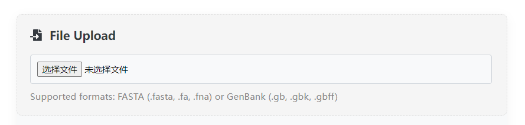

#### FASTA Text Input

Upload the nucleic acid sequence in FASTA text format.  
*Note*: Illegal characters in the sequence will be regarded as "N" and count it into the total length of the sequence.

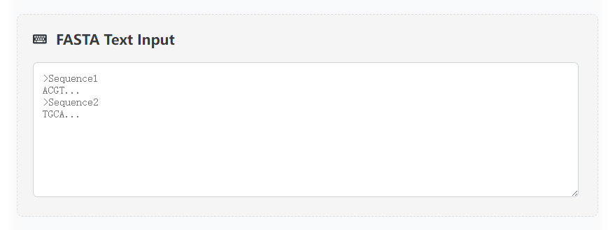

#### NCBI Accession

Enter a legal NCBI Nucleotide accession number (e.g. KP205272.1), and the program can automatically download the sequence from the public database.

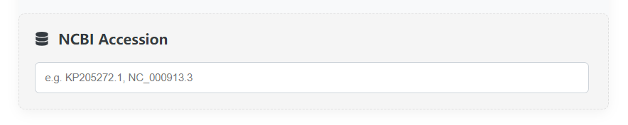

### Settings
Z-curve Plotter manages the input sequences in a card-like manner and enables customized settings for all items conveniently.

#### 2D Mode
The card displays basic information such as the name, length, and GC content of the sequence, as well as options such as the plot start point, plot end point, smoothing window size, and curve types.

- **Start**  
Plot start point. Its index starting from 0 like most programming language, and should not be larger than the length of the sequence.

- **End**  
Plot end point. Its value requirement is the same as that of **Start**.

- **Window**  
The window size of mean smoothing. The range of values is [0, 1000].

- **2D Curve Types**  
Optional curve types, up to 4 types can be selected for each sequence. The definition of each type can be found [here](./introduction.md#main-functions).

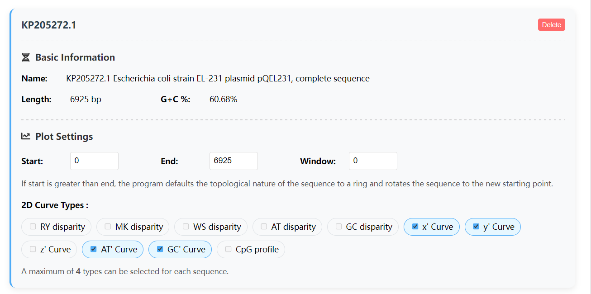

#### 3D Mode
The information displayed on this card is basically the same as that in the 2D mode, but the option of the curve type is limited to the three coordinate axes of the 3D chart.

- **3D Curve Types**  
Any 3 of the 11 components can be selected as the X-axis component, Y-axis component and Z-axis component, but do not choose the same components as different axes, because the result would be trivial.

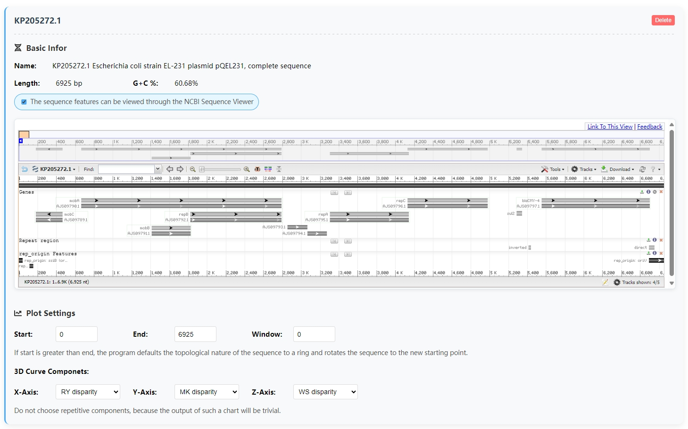

### Visualization
The visualized results can be saved as PNG images via Plotly, or the original data can be saved as JSON through the download button below.  

#### 2D Mode
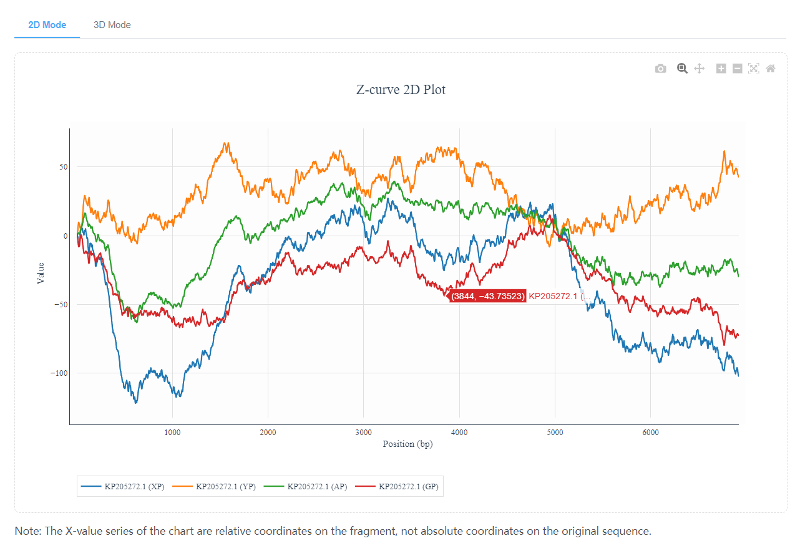
#### 3D Mode
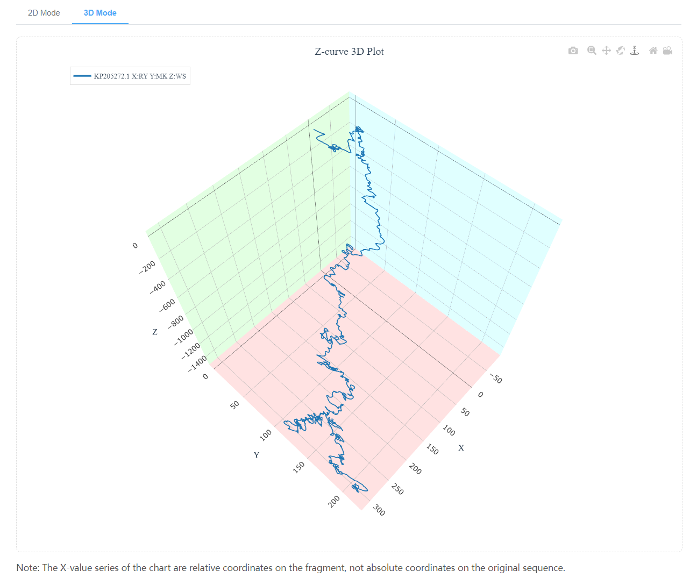

## Z-curve Encoder

### Input
This web application allows users to upload sequences or genomes in FASTA/GenBank format and can choose to use the sequences directly as input or extract CDSs from GenBank as input. Our official server requires that the length of a single sequence cannot exceed **30 kb**, and the total number of sequences cannot exceed **50,000**.  

#### Sequence File Upload

The default input for this application is not allowed to be empty or to submit an empty file. When the machine learning option is turned on, this entry will default to positive sample input. The result of this feature extraction is in `[job_id]_features.npy` in the downloaded output file.  

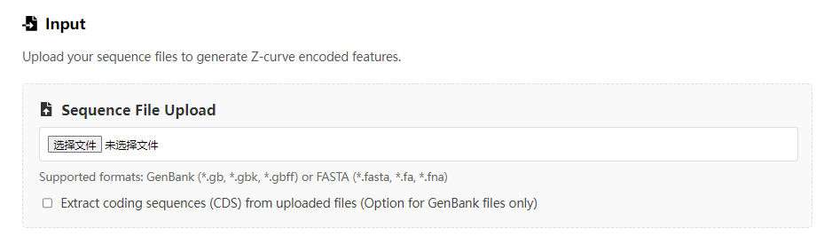

#### Negative Control Upload  

Additional input options for this application. If machine learning is enabled, this option is treated as a negative example control data set, but if machine learning is not enabled, it is treated as just another data set. The result of this feature extraction is in `[job_id]_negctrl_features.npy` in the downloaded output file.  

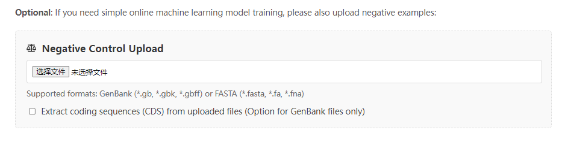

#### Negative Control Shuffling  

An option to generate a random sequence. For the ZCURVE system, it is a means of generating negative examples during self-training, while for the machine learning process, it can verify the validity of the model. The result of this feature extraction is in `[job_id]_shuffle_features.npy` in the downloaded output file.  

- **Negative/Positive Ratio**  
  The ratio between the generated negative and positive samples.  
- **Random Seed**  
  A seed used to generate random numbers.  

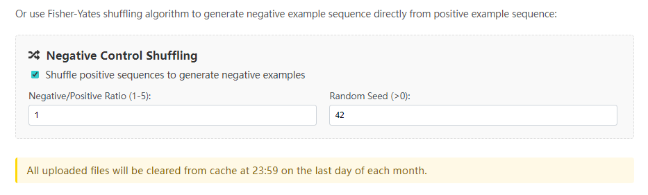

### Settings  

Sets the hyperparameters for the phase-dependent K-nucleotide Z-curve transformation. This module allows the user to freely combine Z-curve parameters (up to 6 layers) to find the most suitable feature extraction scheme. This table can automatically calculate the number of parameters generated by each layer transformation, so that users can design deep learning models.  

- **K-nucleotide**  
  The length of the K-nucleotides to be counted and used in Z-curve transformation (k = 1, 2, 3, 4, 5, 6). 
- **Phase**  
  Total phase number of phase specific Z-curve transformation (phase =1, 2, 3, 4, 5, 6).
- **Frequencized**  
  Whether to enable the frequencized Z-curve parameter. The default mode is the global frequency method.  
  $p_i({\rm N}_{k-1}{\rm X})=n_i({\rm N}_{k-1}{\rm X})/(n - k + 1)$
- **Local**  
  Use the local frequency method.  
  $p_i({\rm N}_{k-1}{\rm X})=n_i({\rm N}_{k-1}{\rm X})/(n_i({\rm N}_{k-1}{\rm A})+n_i({\rm N}_{k-1}{\rm G})+n_i({\rm N}_{k-1}{\rm C})+n_i({\rm N}_{k-1}{\rm T}))$  

**Add A New Row** to increase the number of layers, move the key **Up** and **Down** to change the order in which the parameters appear, and the key **Delete** to reduce the number of layers.

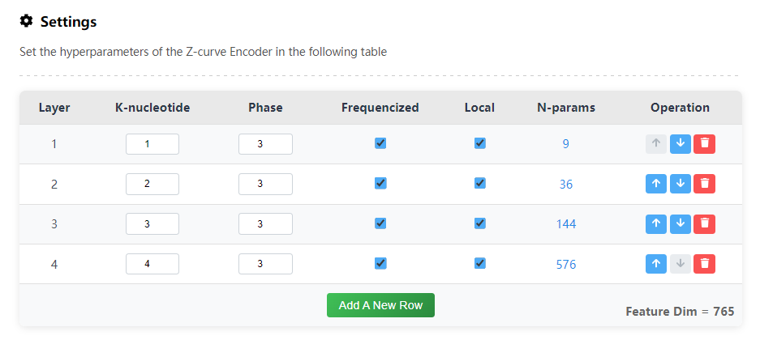

### Preprocessing

Data preprocessing options, available using the API provided by Sci-kit Learn. When checked, the output will overwrite the original encoding result and output the corresponding sklearn object. For example, if the standardization option is checked, an additional `[job_id]_std_scaler.joblib` will appear in the output.

- **Standardization**  
  To extract the features of standardizing operations, will call `sklearn.preprocessing.StandardScaler`

- **Normalization**  
  To extract the features of normalizing operations, will call `sklearn.preprocessing.MinMaxScaler`

- **Principal Component Analysis (PCA)**  
  Perform principal component analysis for dimensionality reduction on the data.  
  - Components  
    The number of components retained in the data after dimensionality reduction.  

- **K-means Clustering**
  Conduct unsupervised cluster analysis on the original data or preprocessed data.
  - Clusters  
    Specify the number of clusters.

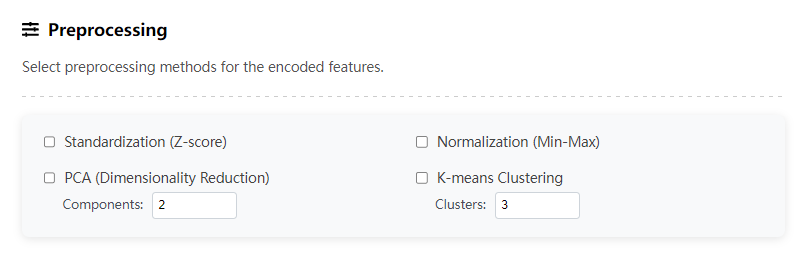

## Z-curve Segmenter

### Input
This Web application allows users to enter in three ways: plain text, file, and NCBI Accession. Either way, only one sequence can be entered. For example, if a user submits a file with multiple sequences, only the first sequence will be taken, and the rest, along with annotation information, will be ignored. Our official server requires that the length of a single sequence cannot exceed **100 kb**.
#### Text Input

The text input field can highlight the A, T, G, and C characters to help you determine the correctness of the input sequence, but only spaces, line feeds, tabs, and carriage returns are filtered out when submitted. Characters such as R, Y, M, K, W, S, B, D, H, V, U are processed normally, and other characters are treated as N (including N).  

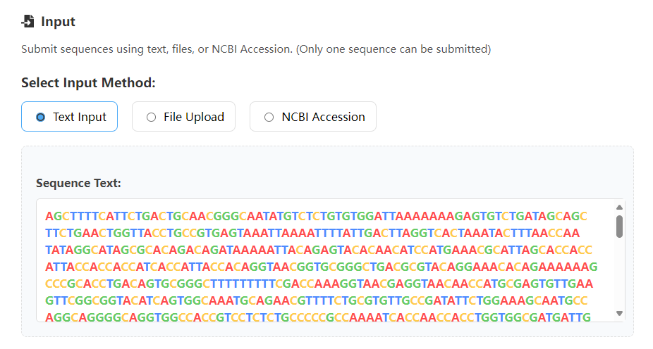

#### File Input
Both FASTA and GenBank inputs are supported, but only one file can be uploaded. If the file contains multiple nucleic acid sequences, the back-end program will only process the first one. All annotations from GenBank will be ignored.  

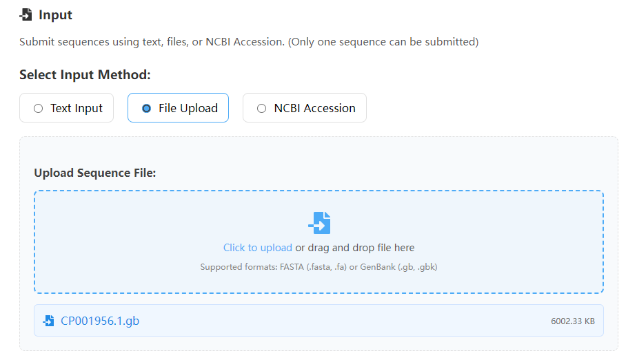

#### Accession Input

Our program supports the online acquisition of sequences from NCBI, but please be careful to enter the correct Accession, not the protein sequence or assembly.  

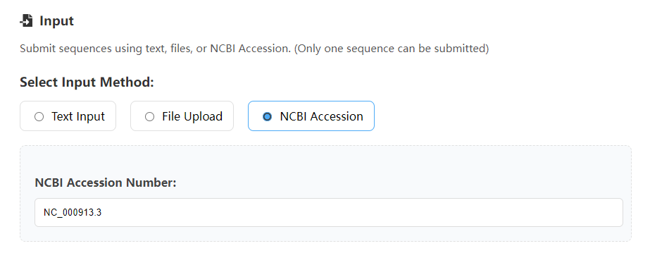

### Options
Select and set the mode of segmentation and the parameters of the algorithm. The Z-curve segmentation method was based on genome order index, and it is a binary iterative algorithm. The segment points in each iteration are calculated by the following formula:  

$n_{\rm seg}={\rm argmax}\{w_1S({\rm P}_n) + w_2S({\rm Q}_n) - S(w_1{\rm P}_n + w_2{\rm Q}_n)\},n=1,2,3...,N$

In the above formula, P represents the left subsequence at point $N$ of a dna sequence of length $n$, and Q represents the right subsequence. 
- **Mode**  
  We provide 7 ways to calculate S:

    | Segmentation Target | Order Index S(P)                | Application                         |
    |:-------------------:|:--------------------------------|:------------------------------------|
    |Z-curve              |$S({\rm P})=a^2+g^2+c^2+t^2$     |Replication Origin Recognition       |
    |RY disparity         |$S({\rm P})=(a^2+g^2)+(c^2+t^2)$ |Mitochondrial rRNA Region Search     |
    |MK disparity         |$S({\rm P})=(a^2+c^2)+(g^2+t^2)$ |Mitochondrial $\rm O_L$ Recognition  |
    |WS disparity         |$S({\rm P})=(a^2+t^2)+(g^2+c^2)$ |Genomic Island Search                |
    |AT disparity         |$S({\rm P})=a^2+t^2$             |                                     |
    |GC disparity         |$S({\rm P})=g^2+c^2$             |Leading/Lagging Chain search         |
    |CpG disparity        |$S({\rm P})=[p_n({\rm CpG})]^2+[1-p_n({\rm CpG})]^2$ |CpG Island Search|

- **Start Position**  
  The start position of the fragment [start, stop) to be segmented.  
  (The subscript starts at 0, as in most computer languages)

- **End Position**  
  The stop position of the fragment [start, stop) to be segmented.  
  (The subscript starts at 0, as in most computer languages)

    **Note**  
    If start is greater than end, the program defaults the topological nature of the sequence to a ring and rotates the sequence to the new starting point.

- **Smoothing Window**  
  The window size used for mean smoothing can reduce the graph sawtooth and make it more beautiful。

- **Halting Parameter**  
  In a round of iteration, if the $n_{seg}$ value of the target fragment is less than this value, the iteration stops.  

- **Max Iterations**  
  Maximum iterations. Prevents users from setting too small a halting parameter and getting stuck in infinite iterations.

- **Min Length**  
  The minimum distance between two segment points. Stop iteration when the distance is less than this.  

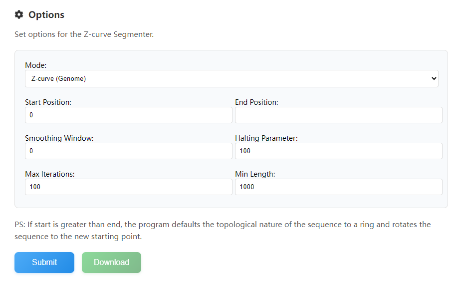

### Visualizaion

The results of the corresponding curve segmentation are visualized, so that users can adjust the parameters. With the powerful Plotly library, you can move, zoom, and hide curves to get the best picture possible. 

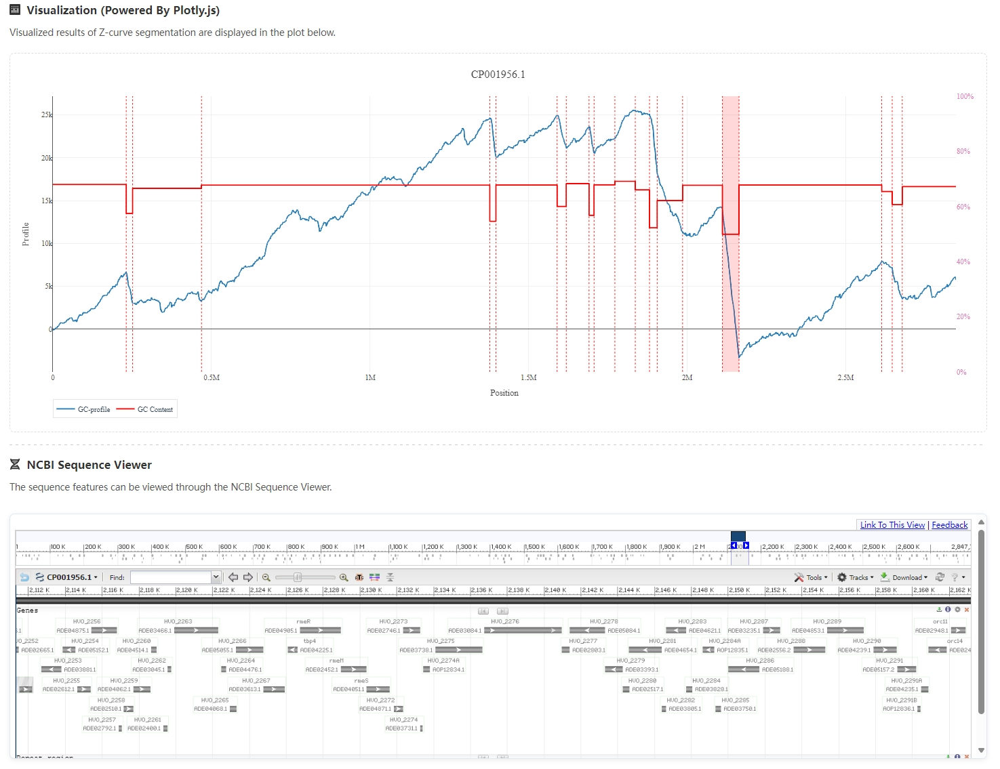

### Results  

Display segment results in tabular form. You can download it via the Download button. Use the Plotly control to save the image display.

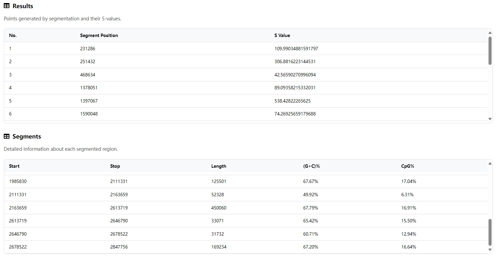